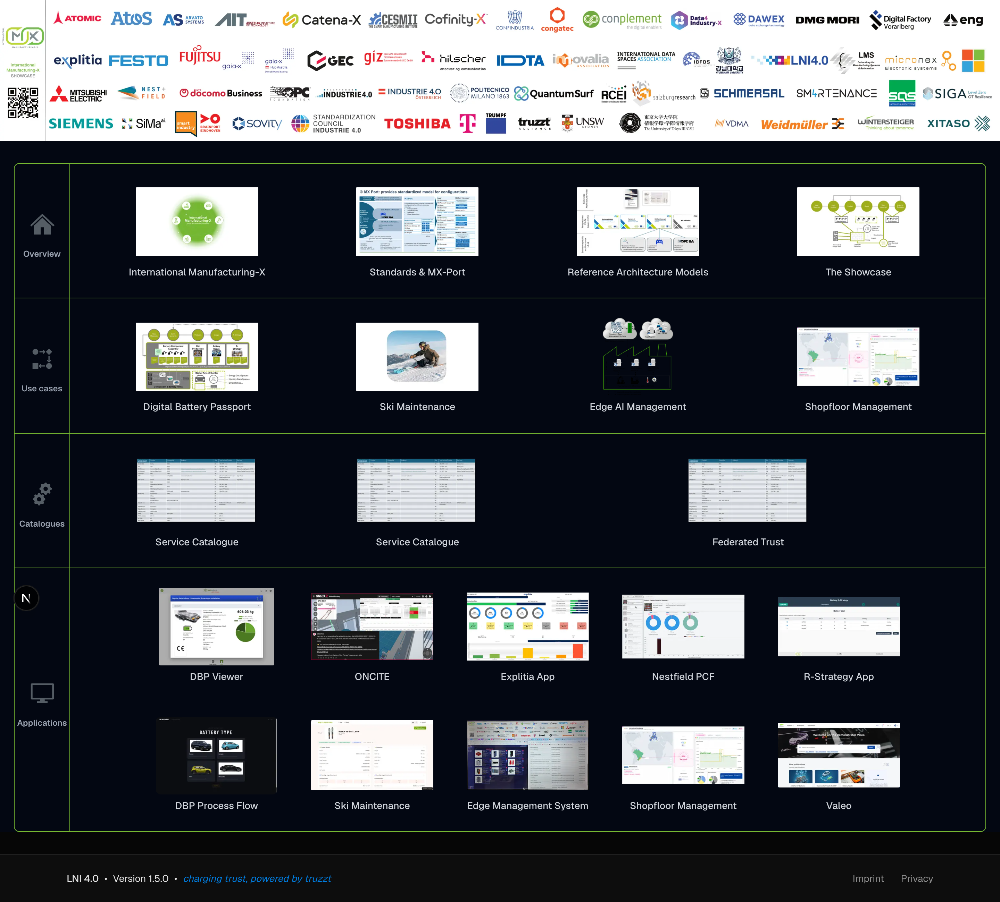
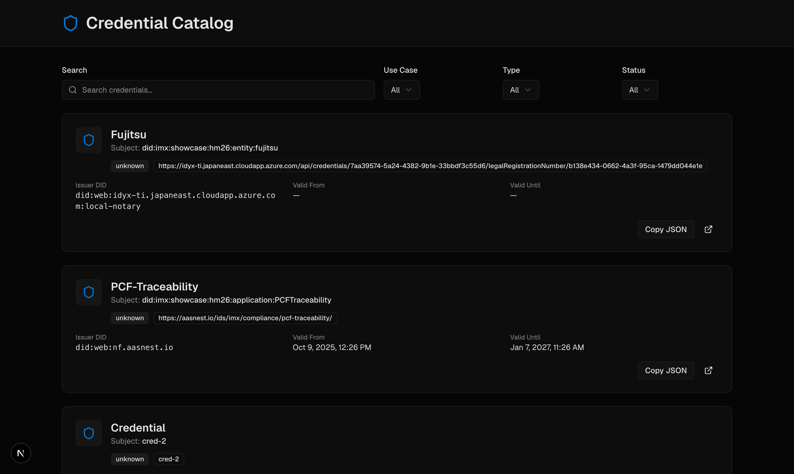
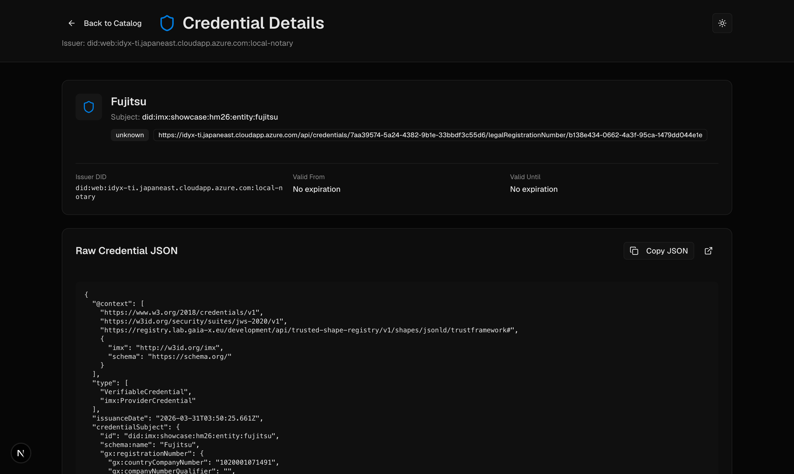
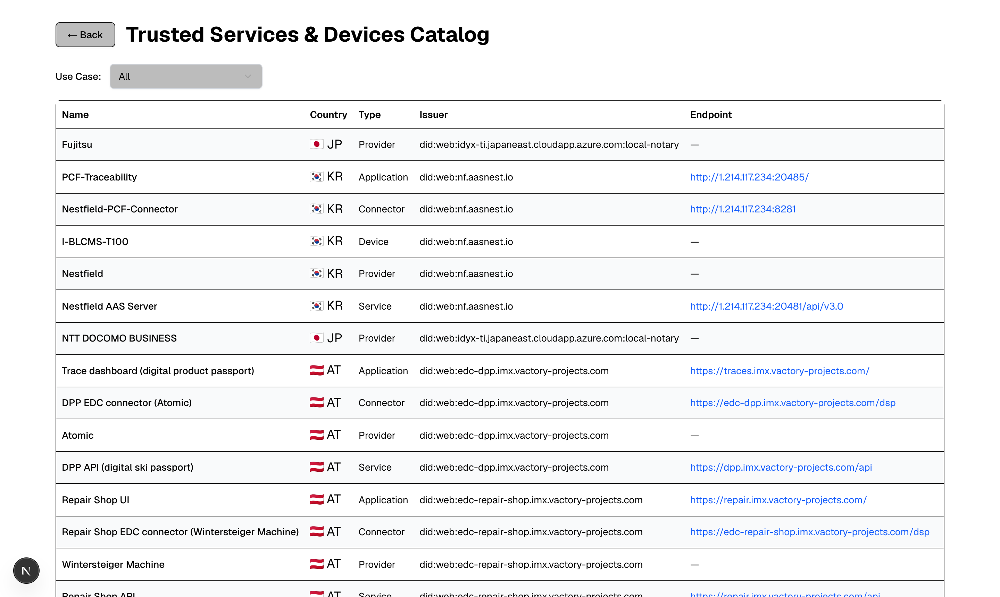

# IMX Federated Catalog Page


An interactive catalog that lets you browse and search Gaia-X verifiable credentials from the International Manufacturing-X (IMX) initiative. You can filter by credential type, use case, and status, copy credential JSON with one click, and jump into detailed views for each entry.

---

## What does the app look like?

### Home Page



The home page is split into four rows. Each row has a small icon and label on the left side and a grid of clickable tiles on the right.

| Row | What it contains | What happens when you click a tile |
|---|---|---|
| **Overview** | IMX topics (Manufacturing-X, Standards, Architecture, Showcase) | Opens a topic page with presentation slides about that topic |
| **Use Cases** | Battery Passport, Ski Maintenance, Edge AI, Shopfloor Management | Opens a topic page explaining that use case with slides |
| **Catalogues** | Service Catalogue (×2) and Federated Trust | Opens the **Trusted Services & Devices Catalog** table, pre-filtered for that use case |
| **Applications** | Partner app tiles (Explitia, Nestfield, R-Strategy, etc.) | Opens the external partner application in a new browser tab. Tiles without a link are coming soon. |

---

### Credential Catalog (`/catalog`)



This is the main credential browser. Here is what each element does:

**Search bar** — Type anything here (a company name, a DID, a credential type) and the list below updates instantly. It searches across the credential ID, issuer name, subject ID, and credential type at the same time.

**Use Case dropdown** — Narrows the list to credentials belonging to a specific use case:
- *All* — show everything
- *Digital Battery Passport* — only battery-related credentials
- *Ski Maintenance* — only ski maintenance credentials

**Type dropdown** — Filter by what kind of credential it is:
- *Participant* — an organisation that is a member of the dataspace
- *Application* — a software application registered in the dataspace
- *Service* — a service endpoint registered in the dataspace

**Status dropdown** — Filter by validity:
- *Active* — credential is currently valid
- *Expiring Soon* — valid but expires within the next 30 days
- *Unknown* — no validity date information available

**Credential cards** — Each card shows one credential. The information on a card:
- **Name / title** — the subject's name from `schema:name`, or the credential type if no name is found
- **Subject** — the DID (decentralised identifier) of the entity the credential describes
- **Badge (unknown / active / expiring soon)** — the validity status at a glance
- **Issuer DID** — the organisation that issued and signed this credential
- **Valid From / Valid Until** — the date range during which the credential is valid. "No expiration" means no end date was set.
- **Copy JSON button** — copies the full raw credential JSON to your clipboard so you can paste it anywhere
- **External link icon** — opens the credential's own URL in a new tab (only works if the credential has a resolvable URL as its ID)

> **Clicking anywhere on a card** (not just the buttons) opens the full credential detail view.

---

### Credential Detail View



When you click a credential card, you land here. Everything from the list view is shown in a larger layout, plus:

- **Back to Catalog button** (top left arrow) — returns you to the credential list, keeping any filters you had active
- **Issuer** — shown in the subtitle below the page title
- **Subject block** — the name and DID of the entity the credential describes, with the status badge and full credential ID
- **Issuer DID / Valid From / Valid Until** — three columns of metadata shown below the subject block
- **Raw Credential JSON panel** — the complete JSON of the credential, exactly as it was issued. You can scroll through it here.
  - **Copy JSON button** — copies the entire JSON to your clipboard
  - **External link icon** — opens the credential's source URL in a new tab

---

### Trusted Services & Devices Catalog (`/vc-catalog`)



A table view of the same credentials. This view is useful when you want to quickly scan many entries at once.

**← Back button** — returns you to the home page

**Use Case filter** — same as in the card catalog: choose *All*, *Digital Battery Passport*, or *Ski Maintenance*

**Table columns:**
| Column | What it shows |
|---|---|
| **Name** | The registered name of the participant, application, or service |
| **Country** | A flag and country code derived from the credential's `gx:registrationNumber` field |
| **Type** | The credential type with the `imx:` prefix removed (e.g. "Provider", "Application", "Service") |
| **Issuer** | The DID of the organisation that issued the credential |
| **Endpoint** | A clickable link to the service endpoint, if one is registered. Placeholder values ("anyurl", "example.com") are hidden automatically. |

> On mobile screens the table switches to individual cards — one card per credential — with the same information stacked vertically.

---

## First-time setup — step by step

> **Never used a terminal before?**
> A terminal (also called "command line" or "shell") is a text-based window where you type commands. On **Mac** press `Cmd + Space`, type `Terminal`, and hit Enter. On **Windows** press the Windows key, type `cmd`, and hit Enter.

---

### Step 1 — Install Node.js

Node.js is the engine that runs this app. Think of it like installing a game runtime before you can play the game.

1. Go to **https://nodejs.org**
2. Download the version labelled **"LTS"** (Long-Term Support) — this is the stable one
3. Run the installer and click **Next** on every screen (the defaults are fine)
4. When the installer finishes, open a terminal and type the following, then press Enter:

```
node --version
```

You should see something like `v22.x.x`. If you do, Node.js is installed correctly. If you see an error, restart your computer and try again.

---

### Step 2 — Download the project

**Option A — with Git (recommended)**

If you have Git installed, open a terminal and run:

```bash
git clone https://github.com/orbiter-dataspaces/imx-federated-catalog-page-public.git
cd imx-federated-catalog-page-public
```

**Option B — without Git**

1. Go to the GitHub page for this project
2. Click the green **"Code"** button near the top right
3. Click **"Download ZIP"**
4. Unzip the downloaded file somewhere on your computer (e.g. your Desktop)
5. Open a terminal and navigate to that folder:

```bash
# On Mac/Linux:
cd ~/Desktop/imx-federated-catalog-page-public

# On Windows (adjust the path to wherever you unzipped it):
cd C:\Users\YourName\Desktop\imx-federated-catalog-page-public
```

---

### Step 3 — Install the app's dependencies

Dependencies are small helper packages the app needs to run (like plugins). This step downloads all of them automatically.

In your terminal (make sure you are inside the project folder from Step 2), run:

```bash
npm install
```

You will see a lot of text scroll by — that is normal. It can take 1–2 minutes depending on your internet connection. When it finishes, your terminal prompt will appear again.

> **If you see "npm: command not found"** — Node.js did not install correctly. Go back to Step 1 and try reinstalling it.

---

### Step 4 — Start the app

```bash
npm run dev
```

After a few seconds you will see output like this:

```
▲ Next.js 16.x.x
- Local:        http://localhost:3000

✓ Ready in 2.1s
```

Open your web browser (Chrome, Firefox, Edge — any of them) and go to:

```
http://localhost:3000
```

The app is now running on your computer. You should see the IMX catalog home page.

> **To stop the app**, go back to the terminal and press `Ctrl + C`.

---

## Common problems & fixes

**The page won't load / I see "This site can't be reached"**

Make sure the terminal is still running `npm run dev`. If you closed it, run `npm run dev` again. If port 3000 is already used by another app on your machine, Next.js will automatically try port 3001 — check the terminal output for the actual URL.

---

**I see a long error after running `npm install`**

Your Node.js version may be too old. Check it:

```bash
node --version
```

If it shows anything below `v18`, reinstall Node.js from https://nodejs.org (download the LTS version).

---

**The terminal says "Permission denied"**

On Mac/Linux, add `sudo` in front of the command and enter your password when asked:

```bash
sudo npm install
```

---

**The app opens but shows no credentials**

Make sure the `IMXC/` folder exists inside the project directory and contains `.json` files. If you downloaded the ZIP from GitHub, these files should already be included.

---

## Run a production build (optional)

If you want to run the app the same way it would run on a live server (faster, no debug output):

```bash
npm run build
npm run start
```

Then open `http://localhost:3000` as before.

---

## Run with Docker (optional)

If you have Docker installed, you can skip Node.js entirely and run the whole app inside a container:

```bash
docker build -t imx-federated-catalog .
docker run -p 3000:3000 imx-federated-catalog
```

Then open `http://localhost:3000`.

> **What is Docker?** Docker packages the app and all its requirements into a self-contained box that runs the same on any computer. Download it from https://www.docker.com/products/docker-desktop.

---

## For developers

### Available scripts

| Command | What it does |
|---|---|
| `npm run dev` | Start the development server with hot reload |
| `npm run build` | Compile a production build |
| `npm run start` | Serve the production build |
| `npm run lint` | Run ESLint to check code quality |
| `npm run test` | Run the Vitest test suite |

### Project structure

```
app/                  Next.js App Router — pages and layouts
  api/credentials/    API route that reads and normalises IMXC/*.json files
  catalog/            Card-based credential explorer
  vc-catalog/         Table-based credential catalog with country flags
  topic/[slug]/       Dynamic topic pages driven by lib/topics.ts
components/           Reusable UI components (shadcn/ui based)
lib/
  topics.ts           Topic metadata (slugs, slide ranges, extra images)
  utils.ts            Tailwind class-merge helper
IMXC/                 Verifiable Credential JSON files (the actual data)
credentials/          Additional credential files
public/               Static assets (images, icons, slide PNGs)
styles/               Global Tailwind CSS
workflows/            CI and release GitHub Actions
```

### Tech stack

- **Next.js 16** (App Router) + **React 19**
- **TypeScript** with strict mode
- **Tailwind CSS 4** + shadcn/ui primitives
- **Vitest** + Testing Library for tests
- **Semantic Release** for automated versioning

### Contributing

1. Fork the repository and create a feature branch
2. Run `npm install` to install dependencies
3. Make your changes and add or update tests as needed
4. Ensure `npm run lint` and `npm run test` both pass
5. Use semantic-release commit prefixes (`feat:`, `fix:`, `chore:`) in your commit messages
6. Open a pull request against `master`

### CI / CD

- **CI workflow** — runs lint and tests on every pull request
- **Release workflow** — triggered on push to `master`; runs Semantic Release, publishes a GitHub release, and builds + pushes a Docker image to GHCR

---

## License

Maintained by the Orbiter Dataspaces team. Licensing terms are TBD — contact the maintainers before redistribution.
